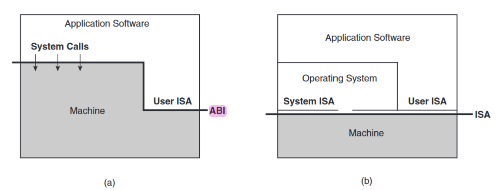
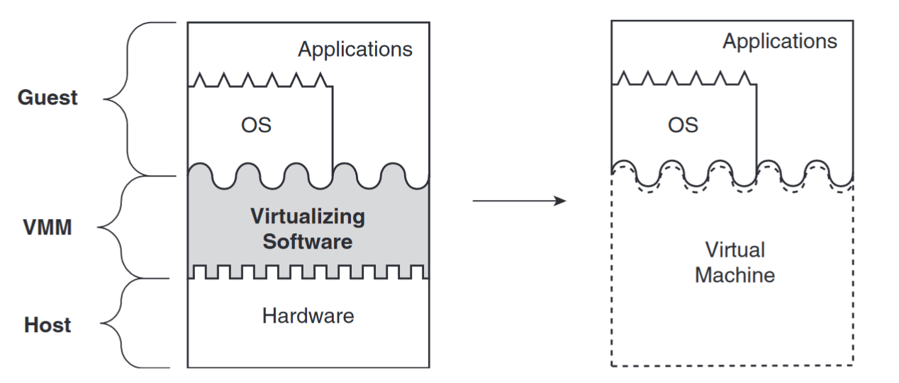
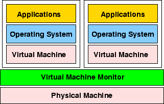
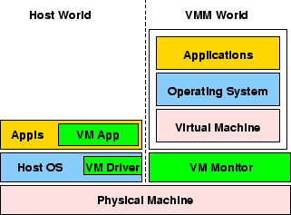
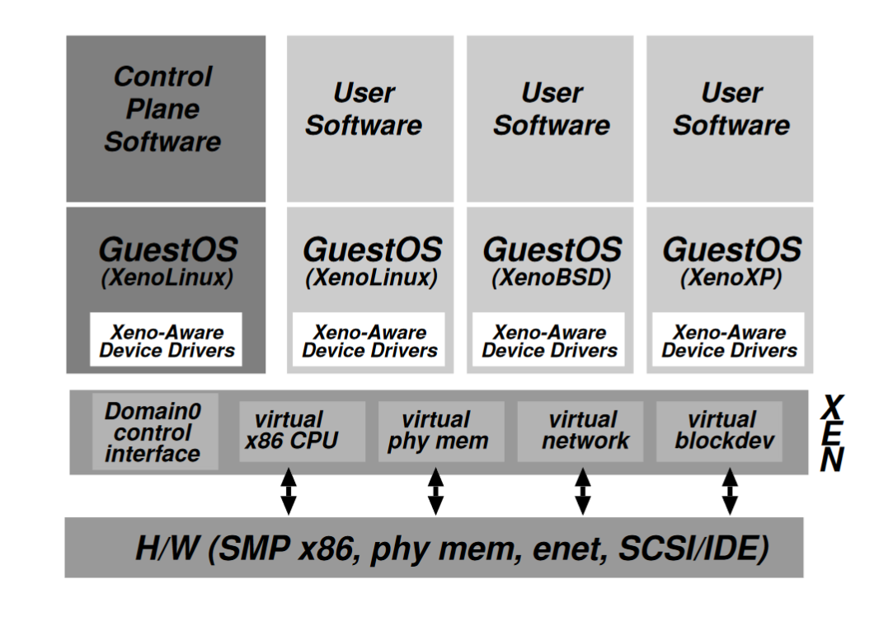
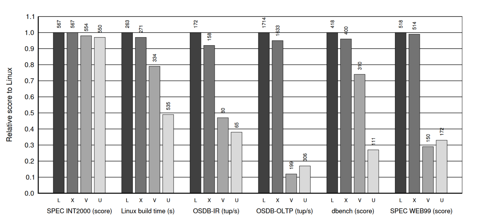
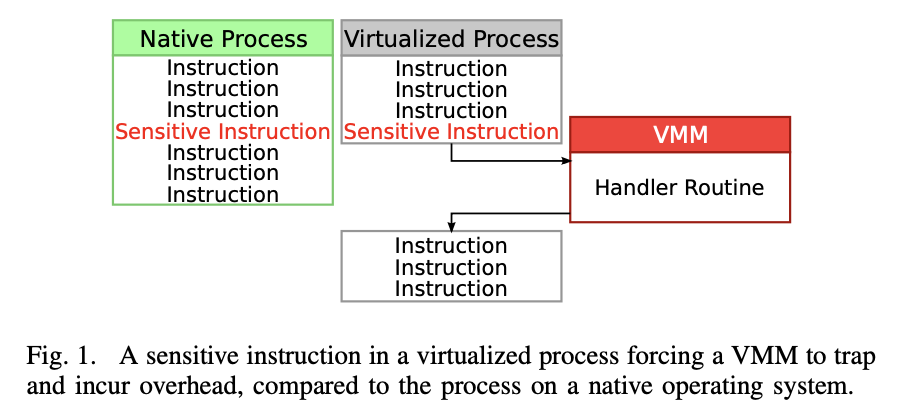
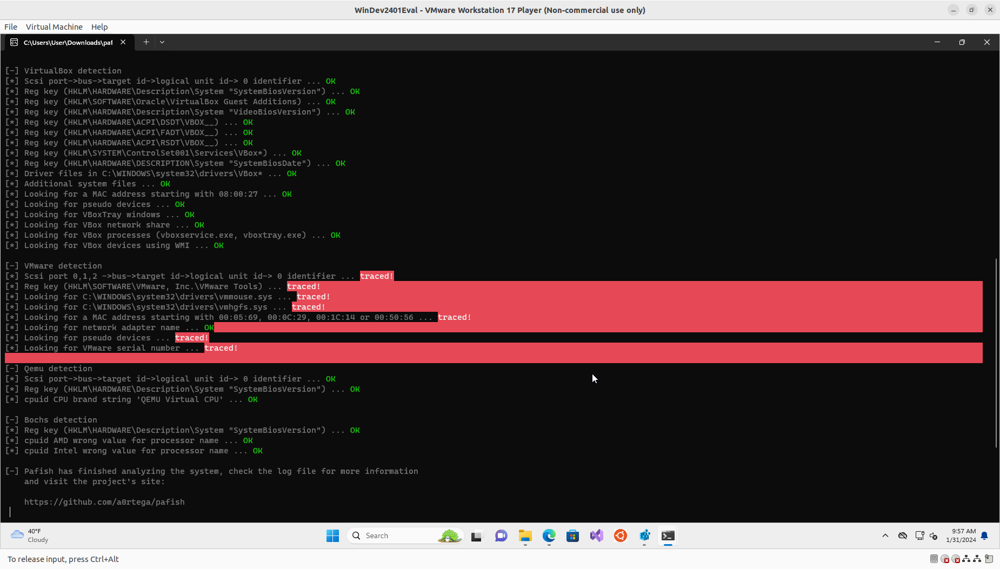
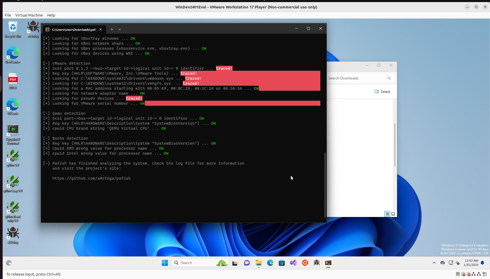

# Introduction

## Why VM

In CSC347:

- Run another O/S with vulunerbility
- Emulate network topology

Generally:

- Kernel development (do not want to crash the working system during debugging)
- Multiple O/S ABI, compatability (Gaming in Windows, Running MS Office on Linux, WSL)
- Multiplexing (Cloud computing like AWS)
- Isolation (Testing a virus in a VM)
- Multiple versions of a shared library

## VM Vendors

- VMWare Workstation / ESXi (Vmware)
- VirtualBox (Oracle)
- QEMU/KVM (Supported by Redhat)
- Xen (Supported by Citrix)

We will use KVM in the lab.

## Similar technologies

### Containers

Depends on OS features, requireing same ABI and ISA.
Provides isolation.

- Docker
- Linux Containers
- K8s

### Other technologies

- Chroot: Changes the `/` directory.
- Wine: Compatability layer (ABI) for Win32

## What is a VM

Proposed in 1974:

> An *efficient*, *isolated*, *duplicate* of the real machine.

- Efficiency: minor performance overhead.
- Resource control: hypervisor has complete control over systme resources.
- Transparency: identical execution environemt

Sounds similar to an O/S.

## Process vs System virtualization

- *Process* virtual machines (like JVM) provide virtual ABI.
- *System* virtual machines provide a complete system environment.

We will focus on system virtual machines.



## How to build a VM

Goal: run (multiple) O/S kernel

Run in an existing O/S, e.g., the Linux Kernel.

O/S provides CPU multiplexing using processes, but in user mode (Ring 3).

What should we do when the kernel wants an priviledged instruction?
(Setting up interrupt handlers, page tables, etc.)

We need some program to handle that (hypervisors).

## VM Topology

We want something to adapt the physical interface to the guest OS.



## Where to place the hypervisor

- Type-I hypervisor: runs directly from the hardware (ESXi, KVM, Xen)
- Type-II hypervisor: runs on an O/S (VirtualBox, VMWare, Qemu)

{width=40%}\ {width=40%}

## How to build a VM - Goals

Performance! We want the guest to be run with small overheads.

### Full virtualization

Interpreting the instructions on the fly. (Similar to Python)

Very slow!

### Paravirtualization

We want the binary to be executed on the CPU directly.

Guests are executed in isolated domain, but harware are not simulated.
Some instructions needs to be handled by the hypervisor.

## Virtualize priviledged instruction

When the guest wants to execute some priviledge instruction, it must be
**intercepted** by the hypervisor so that the request can be
**interpreted** so that the hypervisor does the request for the guest and
pass back the control to the guest.

Ideally the guest should not be aware of this process for transparency.

## Interception - Using traps

When a priviledged instruction is executed in user mode, the CPU will
generate an interrupt (usually Generally Protection) and traps to the kernel.

Problem: some instructions does not get trapped in the original `x86` ISA,
some gets failed silently while others does not need priviledge.

A guest O/S might see nonsense when executing a `SIDT` instruction, which does
not require priviledge.

Ideally, sensitive instruction should be a subset of priviledged instructions.

## Interception - Modification of guest code

Intercept the execution of sensitive instructions, by replacing
them with a call to the hypervisor. (hypercall)

### Binary rewriting

Before loading a binary into the memory, examine them
so that every sensitive instruction is replaced by a hypercall.
Maintains a cache for performance. (VMWare)

### Guest modification

Rewrite the kernel such that priviledged instructions
are replaced by a hypercall. (Xen)

## Hypercalls

Now the CPU is virtualized. What about devices?

IO are just privilged instructions `in`, `out` / mmaped IO. Which are trapped
to the hypervisor when called.

Instead, we can use custom drivers to issue **hypercalls** instead.

> Hypercalls can be must faster than traps.

The guest drivers *know* what the guest O/S are doing, and are aware of
the presence of a hypervisor. Therefore special optimization can be done.

## Hypercalls - Xen



## Hypercalls - Xen performance



## Hardware support

- `vmx` (Intel VT-x), `svm` (AMD-v), allowing the CPU to enter
a virtual execution mode (in Ring 0) but the host OS is still protected.

- Page table virtualization (SLAT): treat guest physical address as a host-virtual address.
Nested Page Tables (AMD), Extended Page Tables (Intel)

- I/O virtualization, IOMMU virtualization: allow mmap'd IO to be used directly in guests: AMD-Vi (AMD), VT-d (Intel)

- Nested (hardware) virtualization.

# VM detection

## VM detection

The problem: dynamic analysis of malware is typically automated and done from virtual machine - but what if the malware is aware?

So we need to understand how: 

1. malware author detect when malware is running in a virtual environment
2. to harden the security system to reduce the odds of evasion
3. to identify anti-VM behavior in order to improve detection

## How malware identify VMs

VM is designed to mimic the hardware.

But artifacts remain which indicate a virtual machine and not a physical one: specific files, processes, registry keys, services, network device adapters

Malware authors code the malware to detect vm configuration files, executables, registry entries or other indicators in order to manipulate their original execution flow -> this behavior is referred to as "Anti-Sandbox", "Anti-VM", "VM Evasion"

## Checking CPU instructions

1. `CPUID` instruction is executed with `EAX=1` as input, the return value describes the processors features
e.g. The 31st bit of `ECX` on a physical machine will be equal to 0; on a guest VM it will equal to 1
2. Hypervisor brand: by calling `CPUID` with `EAX=40000000` as input 1; Malware will return the virtualization vendor string in `EAX`, `ECX`, `EDX`
e.g. Microsoft: "Microsoft HV"; VMware: "VMwareVMware"
3. MMX: an Intel instruction set designed for faster processing of graphical applications. These are usually not supported in VMs so their absence may indicate that the malware is running in a VM
4. `IN`: in VMWare (KVM?) communication with the host is done through a specific I/O port (lab); useful for detecting a VMware environment
e.g. `in eax, #port         'Read input from that port'`

## Checking other paravirtualization devices

- Checking for known MAC addresses: prefixes of MAC addresses indicate the network adapter's vendor. (using WMIC, windows command)

- Checking for registry keys: the existence of the registry entries indicates the existence of virtualization software

- Checking for VM Processes

- Checking existence of VM files, running services such as VMtools (retrieved using WMIC, Win API and CMD)

## Compute CPU overhead time (IPR)
- Execution of some special instructions produce remarkable additional Virtual Machine Monitor overhead.
- Making use of the relative time overhead, VM environment can be detected.
- 


## Anti VM detection (IPR)

CPUID Spoofer, Pafish, al-khaser (bypass vm detection by changing some fields).

Example:
- Starting a Windows 11 vm (maybe should change to Windows 10 later for better illustration)

- Run vm detection (Pafish): 

- Shut down vm, go to physical machine, modify `.vmx` file (vmware):

- modify MAC address to whatever except below:
    00:05:69 (Vmware)
    00:0C:29 (Vmware)
    00:1C:14 (Vmware)
    00:50:56 (Vmware)
    08:00:27 (VirtualBox)

- or equivalently we could add the following to `.vmx` file:


```
ethernet0.address = "00:10:34:3B:F3:11"
ethernet1.address = "00:31:34:37:A6:F9"
```

- Restart the vm and run pafish, it bypasses some detection:



# VM escape

## VM Escape

Virtual machine escape is an exploit in which the attacker runs code on a VM that allows an operating system running within it to break out and interact directly with the hypervisor.

## Case Study - VMware

- Backdoor
	- RPCI (Remote Procedure Call Interface)
	- Drag n Drop
	- Copy Paste

```c
void
Backdoor_InOut(Backdoor_proto *myBp) // IN/OUT
{
   uint64 dummy;

   __asm__ __volatile__(
#ifdef __APPLE__
        /*
         * Save %rbx on the stack because the Mac OS GCC doesn't want us to
         * clobber it - it erroneously thinks %rbx is the PIC register.
         * (Radar bug 7304232)
         */
        "pushq %%rbx"           "\n\t"
#endif
        "pushq %%rax"           "\n\t"
        "movq 40(%%rax), %%rdi" "\n\t"
        "movq 32(%%rax), %%rsi" "\n\t"
        "movq 24(%%rax), %%rdx" "\n\t"
        "movq 16(%%rax), %%rcx" "\n\t"
        "movq  8(%%rax), %%rbx" "\n\t"
        "movq   (%%rax), %%rax" "\n\t"
        "inl %%dx, %%eax"       "\n\t"  /* NB: There is no inq instruction */
        "xchgq %%rax, (%%rsp)"  "\n\t"
        "movq %%rdi, 40(%%rax)" "\n\t"
        "movq %%rsi, 32(%%rax)" "\n\t"
        "movq %%rdx, 24(%%rax)" "\n\t"
        "movq %%rcx, 16(%%rax)" "\n\t"
        "movq %%rbx,  8(%%rax)" "\n\t"
        "popq          (%%rax)" "\n\t"
#ifdef __APPLE__
        "popq %%rbx"            "\n\t"
#endif
      : "=a" (dummy)
      : "0" (myBp)
      /*
       * vmware can modify the whole VM state without the compiler knowing
       * it. So far it does not modify EFLAGS. --hpreg
       */
      :
#ifndef __APPLE__
      /* %rbx is unchanged at the end of the function on Mac OS. */
      "rbx",
#endif
      "rcx", "rdx", "rsi", "rdi", "memory"
   );
}
```

### The Vulnerability

```c
Bool
DnD_TransportBufAppendPacket(DnDTransportBuffer *buf,          // IN/OUT
                             DnDTransportPacketHeader *packet, // IN
                             size_t packetSize)                // IN
{
   ASSERT(buf);
   ASSERT(packetSize == (packet->payloadSize + DND_TRANSPORT_PACKET_HEADER_SIZE) &&
          packetSize <= DND_MAX_TRANSPORT_PACKET_SIZE &&
          (packet->payloadSize + packet->offset) <= packet->totalSize &&
          packet->totalSize <= DNDMSG_MAX_ARGSZ);

   if (packetSize != (packet->payloadSize + DND_TRANSPORT_PACKET_HEADER_SIZE) ||
       packetSize > DND_MAX_TRANSPORT_PACKET_SIZE ||
       (packet->payloadSize + packet->offset) > packet->totalSize || //[1]
       packet->totalSize > DNDMSG_MAX_ARGSZ) {
      goto error;
   }

   /*
    * If seqNum does not match, it means either this is the first packet, or there
    * is a timeout in another side. Reset the buffer in all cases.
    */
   if (buf->seqNum != packet->seqNum) {
      DnD_TransportBufReset(buf);
   }

   if (!buf->buffer) {
      ASSERT(!packet->offset);
      if (packet->offset) {
         goto error;
      }
      buf->buffer = Util_SafeMalloc(packet->totalSize);
      buf->totalSize = packet->totalSize;
      buf->seqNum = packet->seqNum;
      buf->offset = 0;
   }

   if (buf->offset != packet->offset) {
      goto error;
   }

   memcpy(buf->buffer + buf->offset,
          packet->payload,
          packet->payloadSize);
   buf->offset += packet->payloadSize;
   return TRUE;

error:
   DnD_TransportBufReset(buf);
   return FALSE;
}
```

### Overflow

```
packet 1{
 ...
 totalSize = 0x100
 payloadOffset = 0
 payloadSize = 0x50
 seqNum = 0x41414141
 ...
 #...0x50 bytes...#
}

packet 2{
 ...
 totalSize = 0x1000
 payloadOffset = 0x50
 payloadSize = 0x100
 seqNum = 0x41414141
 ...
 #...0x100 bytes...#
}
```

## Exploit

```
tools.capability.dnd_version 3
tools.capability.copypaste_version 3
vmx.capability.dnd_version
vmx.capability.copypaste_version
```

### Defeating ASLR

```
info-set guestinfo.KEY VALUE
info-get guestinfo.KEY
```

`VALUE` is a string and its string length controls the allocation size of a buffer on the heap.

### Code Execution

- Send a `unity.window.contents.start` to write a 64-bit address of a stack pivot gadget at a know address with the `height` and `width` parameters.
- Overwrite the vtable address with a pointer to the 64-bit address (adjusted with the offset of the vtable entry that will be called).
- Trigger the use of the vtable by sending a CopyPaste command.
- ROP.

# Lab

## Lab

We want to show you a hypervisor is implemented, and how exploits works.

We built a [hypervisor](https://github.com/jimmy-zx/kvmdemo/tree/master)
using the KVM module within ~300 LOC.

This hypervisor only handles priviledged IO instructions (`in` and `out`).

## Lab - Tasks

### Task 1

We left a very obvious expolit in the hypervisor.
Identify this exploit, modify the guest to force the hypervisor
to call the function `exploit()`.

### Task 2

You will built a very simple handler to allow the guest to read
characters from the hypervisor's STDIN.

# End of slides

## References

1. [OLS](https://www.kernel.org/doc/ols/2007/ols2007v1-pages-179-188.pdf)
2. [CMU Virtualization slides](https://www.cs.cmu.edu/~410-f06/lectures/L31_Virtualization.pdf)
3. [Wikipedia: x86 virtualization](https://en.wikipedia.org/wiki/X86_virtualization)
4. [Wikipedia: IOMMU](https://en.wikipedia.org/wiki/Input%E2%80%93output_memory_management_unit)
5. [Wikipedia: SLAT](https://en.wikipedia.org/wiki/Second_Level_Address_Translation)
6. [Wikipedia: Virtualization](https://en.wikipedia.org/wiki/Virtualization)
7. [Formal requirements for virtualizable third generation architectures](https://dl.acm.org/doi/10.1145/361011.361073)

### Graphs

1. [James E. Smith and Ravi Nair - Virtual Machines](https://www.sciencedirect.com/book/9781558609105/virtual-machines)
2. [Virtualizing I/O Devices on VMware Workstation's Hosted Virtual Machine Monitor](https://www.usenix.org/conference/2001-usenix-annual-technical-conference/virtualizing-io-devices-vmware-workstations)
3. [Xen and the art of virtualization](https://dl.acm.org/doi/10.1145/945445.945462)

## License

This work (README.md) is licensed under CC BY 4.0.
